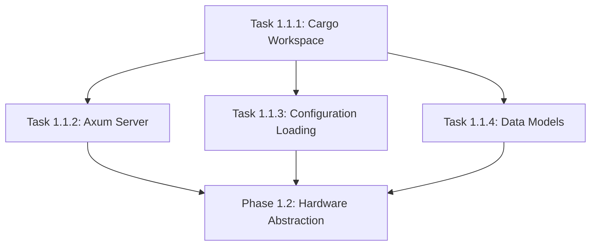

# Phase 1.1: Project Setup - Task Overview

## Epic Summary

Establish the foundational infrastructure for the RPI Smoker project, including Cargo workspace setup, web server configuration, configuration management, and core data models.

## Tasks Breakdown

### Task 1.1.1: Create Cargo Workspace with Backend Crate

**Priority**: High | **Story Points**: 3 | **Dependencies**: None

Create the root Cargo workspace and backend crate structure with proper dependencies and feature flags for cross-platform development.

**Key Deliverables**:

- Root `Cargo.toml` workspace configuration
- Backend crate with required dependencies
- Feature flags for hardware-specific code
- Basic compilation verification

### Task 1.1.2: Set up Axum Web Server with Basic Routing

**Priority**: High | **Story Points**: 5 | **Dependencies**: Task 1.1.1

Implement the foundational Axum web server with routing structure, middleware, and basic endpoint placeholders.

**Key Deliverables**:

- Axum server with configurable port binding
- Complete API route structure (placeholder handlers)
- CORS and logging middleware
- Graceful shutdown implementation
- Health check endpoint

### Task 1.1.3: Implement Configuration Loading from JSON

**Priority**: High | **Story Points**: 5 | **Dependencies**: Task 1.1.1

Build a robust configuration system supporting JSON files, validation, CLI overrides, and runtime updates.

**Key Deliverables**:

- Comprehensive configuration structs
- JSON file loading with validation
- CLI argument parsing and overrides
- Configuration update API endpoints
- Default configuration file

### Task 1.1.4: Create Basic Data Models and Validation

**Priority**: High | **Story Points**: 4 | **Dependencies**: Task 1.1.1

Define core data structures for sensors, fans, alarms, and statistics with validation and serialization support.

**Key Deliverables**:

- Complete data model definitions
- Validation functions for all models
- API response structures
- Error handling types
- Comprehensive unit tests

## Execution Order

## Success Criteria for Phase 1.1

### Technical Milestones

- [ ] Complete Cargo workspace builds successfully
- [ ] Axum server starts and serves basic routes
- [ ] Configuration loads from JSON with validation
- [ ] All core data models implemented with tests
- [ ] No compilation warnings or errors
- [ ] Basic integration test passes

### Quality Gates

- [ ] Unit test coverage >90% for all modules
- [ ] All validation rules tested with edge cases
- [ ] Documentation complete for public APIs
- [ ] Code follows Rust best practices and formatting
- [ ] Error messages are clear and actionable

## Estimated Timeline

- **Total Duration**: 4-5 days for experienced developer, 7-10 days for junior developer
- **Parallel Development**: Tasks 1.1.2, 1.1.3, and 1.1.4 can be developed in parallel after 1.1.1

## Risk Mitigation

- **Cross-compilation issues**: Use feature flags early and test on target platform
- **Configuration complexity**: Start with simple structure, iterate based on needs
- **Data model changes**: Design for extensibility, use proper versioning
- **Integration challenges**: Maintain clear interfaces between modules

## Definition of Done for Phase 1.1

- All four tasks completed and validated
- Integration test demonstrates end-to-end functionality
- Code review completed and approved
- Documentation updated
- Ready to proceed to Phase 1.2 (Hardware Abstraction Layer)

## Notes

- This phase establishes the foundation for all subsequent development
- Focus on getting the architecture right before adding complexity
- Consider setting up CI/CD pipeline during this phase
- Plan for configuration schema evolution as features are added
